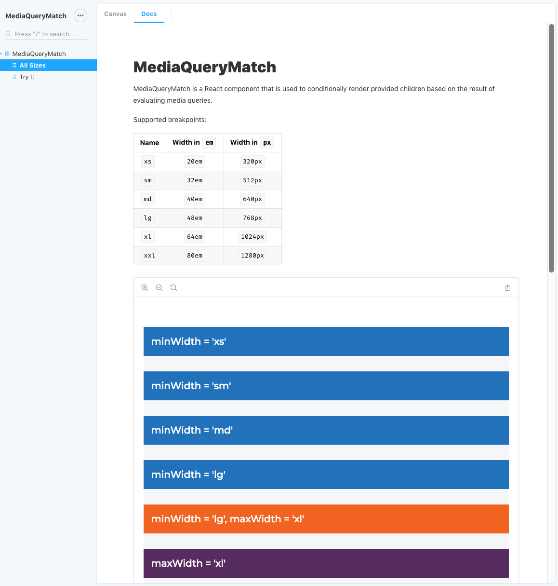
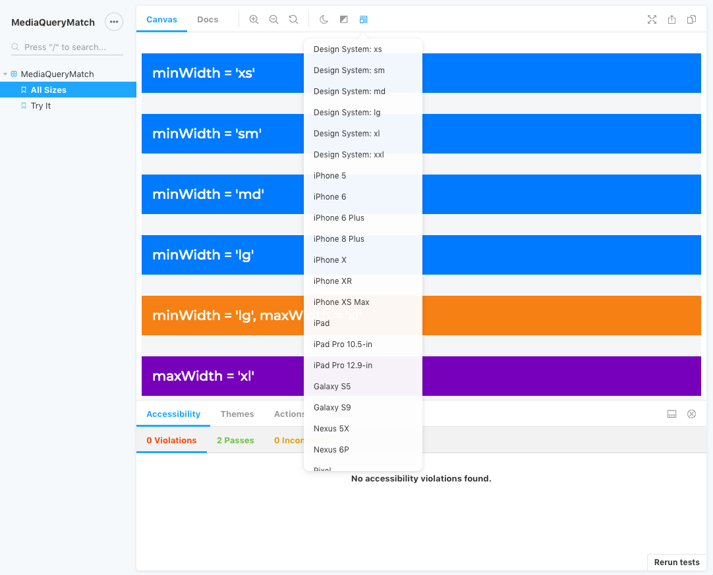
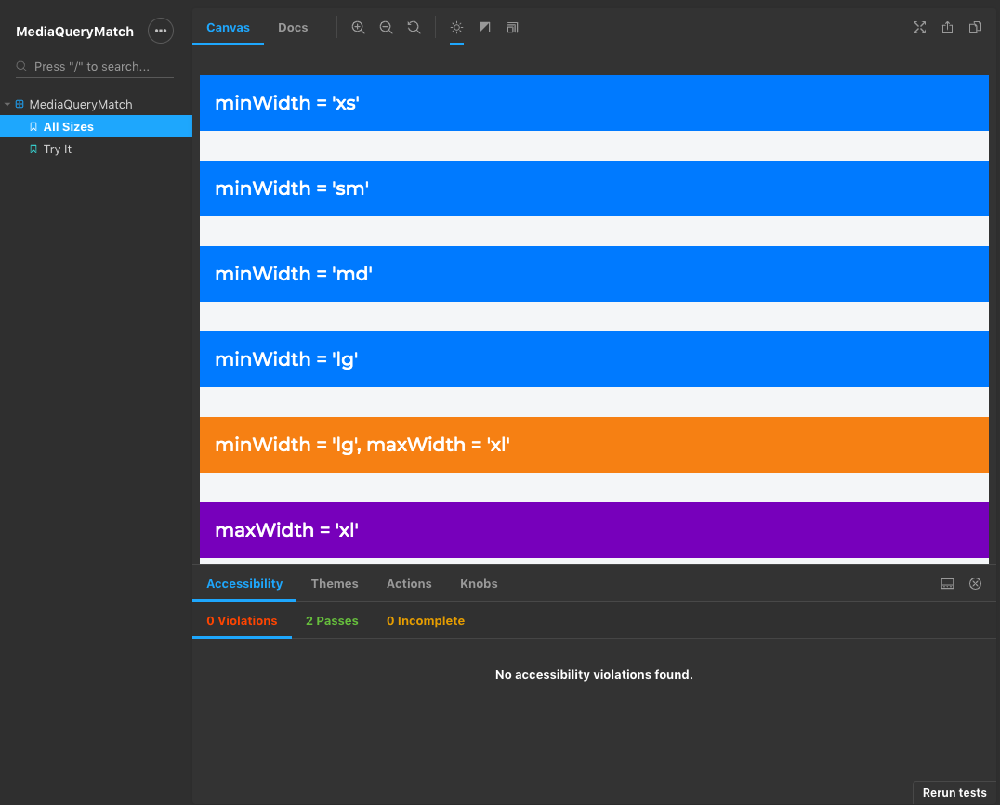
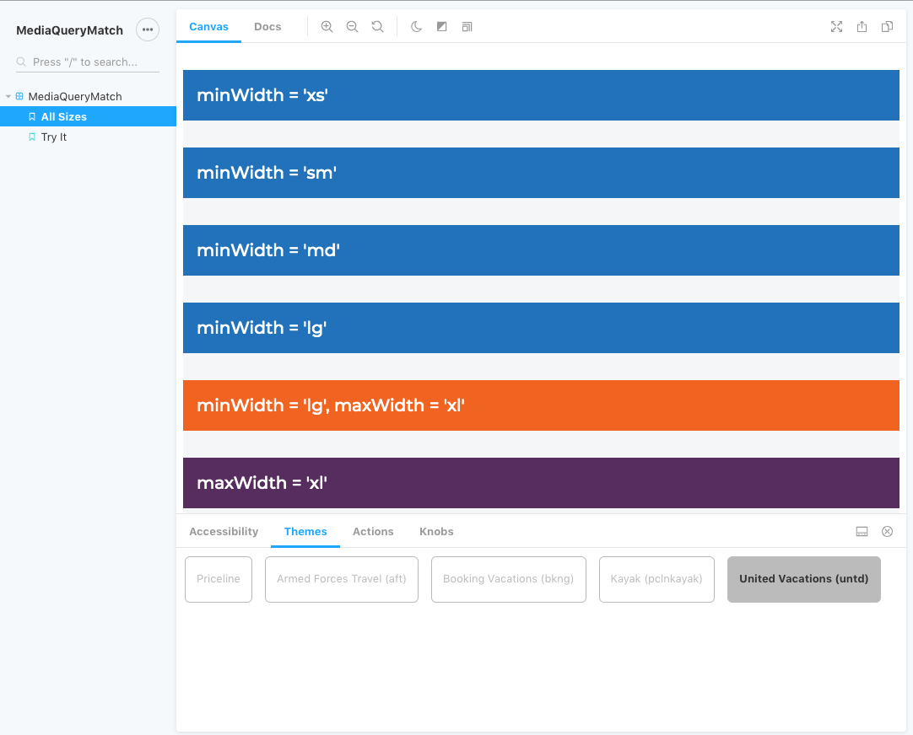
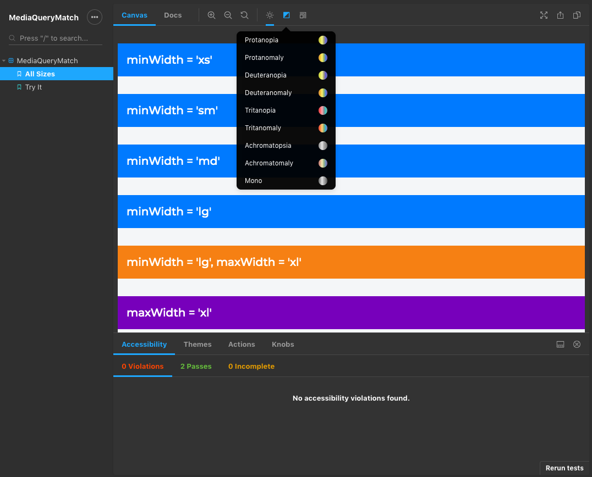
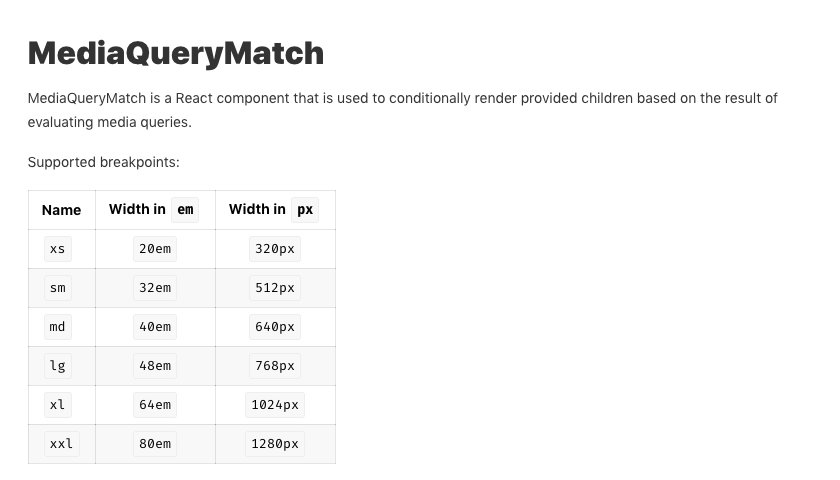
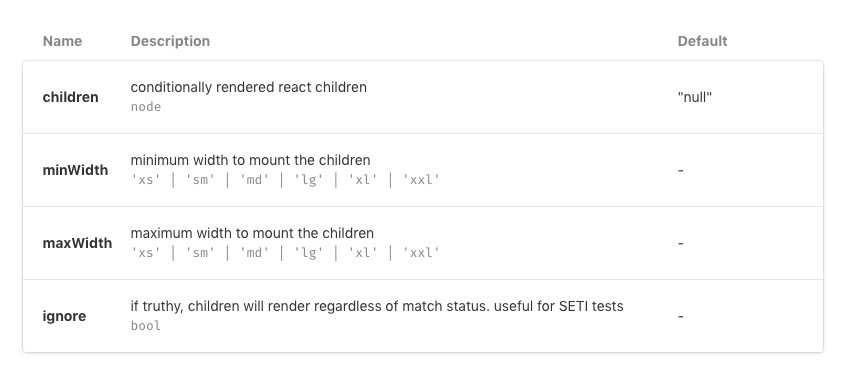

# @priceline/storybook-preset

> Sensible defaults for PCLN Storybooks

This package provides a preset for [Storybook](https://storybook.js.org/). The motivations for this package are:

1. Provide a consistent Storybook experience across Priceline, with a curated list of tools.
2. Minimize developer effort to keep Storybook up-to-date on a per project basis.
3. Facilitate easily adding new features.

## Features

- Documentation via Docs addon

  

- Viewports plugin, configured to include breakpoints from `pcln-design-system`

  

- Dark mode

  

- Theme Switcher, configured with Whitelabel partner themes

  

- Accessibility plugin

  

- Actions
- Knobs

## Setup

1. Babel 7 is required.
2. Install devDependencies

   1. `@priceline/storybook-preset`
   2. `@storybook/react`
   3. `@storybook/addon-actions`
   4. `babel-loader`

   ```bash
     npm i -D @priceline/storybook-preset @storybook/react @storybook/addon-actions babel-loader
   ```

3. Update `scripts` in package.json

   ```json
     "start": "start-storybook",
   ```

4. Create a `.storybook/` directory in the root of your project. It should contain:

`babel.config.js` - The following assumes `@priceline/babel-preset-react-component` and a root `babel.config.js`, but any valid Babel configuration for your codebase should work.

```javascript
const path = require('path')

const baseBabelConfig = require(path.resolve('babel.config'))

module.exports = baseBabelConfig
```

`config.js` - Change the `brandTitle`, `brandUrl` and the regex passed to `require.context` to match the location of the stories.

```javascript
import React from 'react'

import {
  configure,
  addDecorator,
  addParameters,
  setAddon,
} from '@storybook/react'

import { createTheme, ThemeProvider } from 'pcln-design-system'

import { clientConfig } from '@priceline/storybook-preset'

addParameters({
  options: {
    theme: {
      brandTitle: 'My Project Name',
      brandUrl:
        'https://github.com/pcln/pcln-web/tools/storybook-preset',
    },
  },
})

clientConfig({ addDecorator, addParameters, createTheme, ThemeProvider })

configure(require.context('../src', true, /\.stories\.js$/), module)
```

`presets.js`

```javascript
module.exports = [
  '@priceline/storybook-preset',
  {
    name: '@storybook/addon-docs/preset',
    options: {
      configureJSX: true,
    },
  },
]
```

`preview-body.html`

```html
<!-- Google Fonts (Montserrat) -->
<link
  href="https://fonts.googleapis.com/css?family=Montserrat:500,700"
  rel="stylesheet"
/>
<!-- End Google Fonts (Montserrat) -->
```

## Using `addon-docs`

Including relevant data for `@storybook/addon-docs` is strongly encouraged:

- JSDoc comments for exported components. Here's an example from [MediaQueryMatch src](https://github.com/pcln/pcln-web/react-components/media-query-match/src/MediaQueryMatch.js): [MediaQueryMatch generated docs](https://github.com/pcln/pcln-web/tree/master/storybook/universal-storybook?path=/docs/mediaquerymatch--all-sizes).

  **NOTE** The leading `**` is important.

  

  ```javascript
    /**
     * MediaQueryMatch is a React component that is used to conditionally render provided children based on the
     * result of evaluating media queries.
     *
     * Supported breakpoints:
     *
     * | Name             | Width in `em`     | Width in `px` |
     * | :--------------- | :----------:  | :------------------: |
     * | `xs`   | `20em`         | `320px`             |
     * | `sm`   | `32em`         | `512px`             |
     * | `md`   | `40em`         | `640px`             |
     * | `lg`   | `48em`         | `768px`             |
     * | `xl`   | `64em`         | `1024px`             |
     * | `xxl`   | `80em`         | `1280px`             |
     */
    const MediaQueryMatch = ({
  ```

- JSDoc comment annotations for PropTypes definitions

  

  ```javascript
  MediaQueryMatch.propTypes = {
    /** minimum width to mount the children */
    minWidth: PropTypes.oneOf(['xs', 'sm', 'md', 'lg', 'xl', 'xxl']),

    /** maximum width to mount the children */
    maxWidth: PropTypes.oneOf(['xs', 'sm', 'md', 'lg', 'xl', 'xxl']),

    /** if truthy, children will render regardless of match status. useful for SETI tests */
    ignore: PropTypes.bool,

    /** conditionally rendered react children */
    children: PropTypes.node,
  }
  ```

## Changelogs

Changelogs are generated automatically by [Rush](https://rushjs.io/). They are available in the following formats:

- Markdown [CHANGELOG.md](CHANGELOG.md)
- JSON [CHANGELOG.json](CHANGELOG.json)

## Support and Feature Requests
